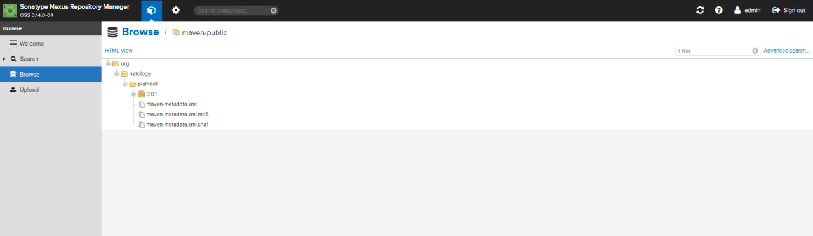

# Домашнее задание к занятию 11 «Teamcity»

## Подготовка к выполнению

1. В Yandex Cloud создайте новый инстанс (4CPU4RAM) на основе образа `jetbrains/teamcity-server`.
2. Дождитесь запуска teamcity, выполните первоначальную настройку.
3. Создайте ещё один инстанс (2CPU4RAM) на основе образа `jetbrains/teamcity-agent`. Пропишите к нему переменную окружения `SERVER_URL: "http://<teamcity_url>:8111"`.
4. Авторизуйте агент.
5. Сделайте fork [репозитория](https://github.com/aragastmatb/example-teamcity).
6. Создайте VM (2CPU4RAM) и запустите [playbook](./infrastructure).


## Основная часть

1. Создайте новый проект в teamcity на основе fork.


2. Сделайте autodetect конфигурации.


3. Сохраните необходимые шаги, запустите первую сборку master.


4. Поменяйте условия сборки: если сборка по ветке `master`, то должен происходит `mvn clean deploy`, иначе `mvn clean test`.


5. Для deploy будет необходимо загрузить [settings.xml](./teamcity/settings.xml) в набор конфигураций maven у teamcity, предварительно записав туда креды для подключения к nexus.


6. В pom.xml необходимо поменять ссылки на репозиторий и nexus.


7. Запустите сборку по master, убедитесь, что всё прошло успешно и артефакт появился в nexus.



8. Мигрируйте `build configuration` в репозиторий.


9. Создайте отдельную ветку `feature/add_reply` в репозитории.

```bash
git switch -c feature/add_reply
```

---
10. Напишите новый метод для класса Welcomer: метод должен возвращать произвольную реплику, содержащую слово `hunter`.

```bash

...
	public String sayHunterHunt() {
    return "The hunter is tracking the prey";
}
...

```

---

11. Дополните тест для нового метода на поиск слова `hunter` в новой реплике.

```bash

...
	@Test
	public void welcomerSaysHunterHunt(){
		assertThat(welcomer.sayHunterHunt(), containsString("hunter"));
	}
...

```

---

12. Сделайте push всех изменений в новую ветку репозитория.

```bash
 git push origin feature/add_reply 
Enumerating objects: 20, done.
Counting objects: 100% (20/20), done.
Delta compression using up to 4 threads
Compressing objects: 100% (6/6), done.
Writing objects: 100% (11/11), 797 bytes | 265.00 KiB/s, done.
Total 11 (delta 3), reused 0 (delta 0), pack-reused 0
remote: Resolving deltas: 100% (3/3), completed with 3 local objects.
remote: 
remote: Create a pull request for 'feature/add_reply' on GitHub by visiting:
remote:      https://github.com/Barsukov-Alex/example-teamcity/pull/new/feature/add_reply
remote: 
To https://github.com/Barsukov-Alex/example-teamcity.git
 * [new branch]      feature/add_reply -> feature/add_reply
```

13. Убедитесь, что сборка самостоятельно запустилась, тесты прошли успешно.


14. Внесите изменения из произвольной ветки `feature/add_reply` в `master` через `Merge`.

```bash
git checkout master
git pull origin master
git merge feature/add_reply
git push origin master
```

---

15. Убедитесь, что нет собранного артефакта в сборке по ветке `master`.

Сборка не прошла по причине уже существующих файлов.

16. Настройте конфигурацию так, чтобы она собирала `.jar` в артефакты сборки.

Настройки были сделаны изначально. Никаких действий не требуется.

17. Проведите повторную сборку мастера, убедитесь, что сбора прошла успешно и артефакты собраны.


18. Проверьте, что конфигурация в репозитории содержит все настройки конфигурации из teamcity.

19. В ответе пришлите ссылку на репозиторий.

---

### Как оформить решение задания

Выполненное домашнее задание пришлите в виде ссылки на .md-файл в вашем репозитории.

---
